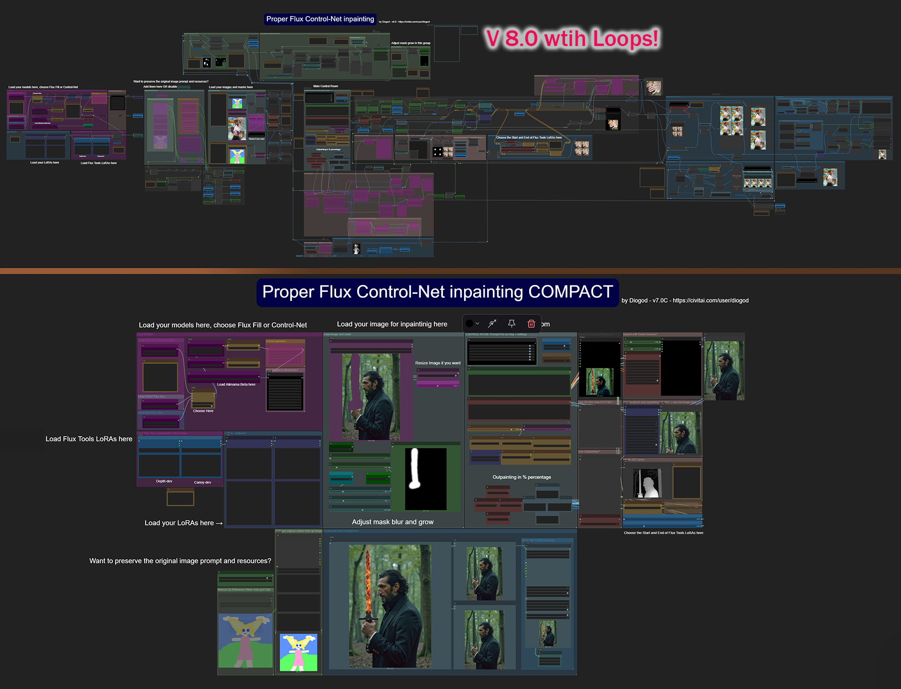

<!-- Improved compatibility of back to top link: See: https://github.com/othneildrew/Best-README-Template/pull/73 -->

<a id="readme-top"></a>

<!--
*** Thanks for checking out the Best-README-Template. If you have a suggestion
*** that would make this better, please fork the repo and create a pull request
*** or simply open an issue with the tag "enhancement".
*** Don't forget to give the project a star!
*** Thanks again! Now go create something AMAZING! :D
-->

<!-- PROJECT SHIELDS -->

<!--
*** I'm using markdown "reference style" links for readability.
*** Reference links are enclosed in brackets [ ] instead of parentheses ( ).
*** See the bottom of this document for the declaration of the reference variables
*** for contributors-url, forks-url, etc. This is an optional, concise syntax you may use.
*** https://www.markdownguide.org/basic-syntax/#reference-style-links
[![Contributors][contributors-shield]][contributors-url]

-->

[](https://discord.gg/EwKE8KBDqD)
[![Stargazers][stars-shield]][stars-url]
[![Issues][issues-shield]][issues-url]
[![Forks][forks-shield]][forks-url]
[![Dynamic TOML Badge][version-shield]][version-url]

<!-- PROJECT LOGO -->

<br />
<div align="center">
  <a href="https://discord.gg/EwKE8KBDqD">
    
  </a>

<h3 align="center">Comfy-Inpainting-Works</h3>

<p align="center">
     This repository is dedicated to maintaining, updating, fixing bugs and keeping up to date BOTH my Expanded and Compact inpainting ComfyUI workflow. It was previously hosted on CivitAI called: 
    <br />
    <br /> 
    Proper Flux Control-Net inpainting and/or outpainting with batch size - ComfyUI - Alimama or Flux Fill
    <br />
    <br />
    <a href="https://github.com/diodiogod/Comfy-Inpainting-Works/issues/new?labels=bug&template=bug-report---.md">Report Bug</a>
    ·
    <a href="https://github.com/diodiogod/Comfy-Inpainting-Works/issues/new?labels=enhancement&template=feature-request---.md">Request Feature</a>
    ·
    <a href="#getting-started">Install it with the Manager</a>
  </p>
</div>

<!-- TABLE OF CONTENTS -->

<details>
  <summary>Table of Contents</summary>
  <ol>
    <li>
      <a href="#about-the-project">About The Project</a>
      <ul>
        <li><a href="#features">Features</a></li>
        <li><a href="#videos">Videos</a></li>
      </ul>
    </li>
    <li>
      <a href="#getting-started">Getting Started</a>
      <ul>
        <li><a href="#prerequisites">Prerequisites</a></li>
      </ul>
    </li>
    <li><a href="#written-usage">Written Usage</a>
      <ul>
        <li><a href="#1-loading-the-models">1. Loading the Models</a></li>
        <li><a href="#2-controlnet-integration">2. ControlNet Integration</a></li>
        <li><a href="#3-masking-techniques">3. Masking Techniques</a></li>
        <li><a href="#4-outpainting">4. Outpainting</a></li>
        <li><a href="#5-basic-lora">5. Basic LoRA</a></li>
        <li><a href="#6-localized-area-inpainting">6. Localized Area Inpainting</a></li>
        <li><a href="#7-daemon-detailer">7. Daemon Detailer</a></li>
        <li><a href="#8-fast-fill-auto1111-style">8. Fast Fill</a></li>
        <li><a href="#9-negative-thresholding">9. Negative Thresholding</a></li>
        <li><a href="#10-loops">10. Loops</a></li>
        <li><a href="#11-scheduling">11. Scheduling</a></li>
        <li><a href="#12-resizing-and-compositing">12. Resizing & Compositing</a></li>
        <li><a href="#13-metadata">13. Metadata</a></li>
      </ul>
    </li>
    <li><a href="#roadmap">Roadmap</a></li>
    <li><a href="#contributing">Contributing</a></li>
    <li><a href="#discord-server">Discord Server</a></li>
    <li><a href="#contact">Contact</a></li>
    <li><a href="#acknowledgments">Acknowledgments</a></li>
  </ol>
</details>

<!-- ABOUT THE PROJECT -->

## About The Project

<div align="center">
<a href="https://github.com/diodiogod/Comfy-Inpainting-Works">
  
</a>
</div>

The core objective with this workflow is to make the best flux inpainting for ComfyUI that is done correctly. Meaning: 

* $${\color{yellow}Compositing}$$ (not damaging the non-inpainted original pixels with VAE degradation)
* $${\color{orange}Making \space sure \space the \space image \space it’s \space divisible \space by \space 8}$$ (preserving the original image quality by not stretching it while using it).

It started as me trying to make a simple Flux inpainting workflow, but after that the idea to make this as complete and well done as possible started growing on me. It ended up not being that simple anymore, as I added more and more interesting tools and options, either to make life easier or to improve the inpainting results.

As I pointed out [here](https://www.reddit.com/r/StableDiffusion/comments/1gy87u4/this_looks_like_an_epidemic_of_bad_workflows/?utm_source=share&utm_medium=web3x&utm_name=web3xcss&utm_term=1&utm_content=share_button),  Comfyorg themselves forgets about compositing and teaches it in the wrong way in their basic inpaint workflow, unfortunately. This led to a widespread of bad inpainting workflows out there and pretty much all workflows have this basic mistake.

Because the expanded workflow might look rather monstrous and scary, and frankly not user friendly, I also aimed to publish a “Compact” version, where everything is hidden and nodes are kept in a clean interface with options more at reach. And some decisions are made for you. They are supposed to be the same but one thing or other might be missing on Compact as it lags behind on me updating it. Also, it’s way harder for the user to customize it, for example adding a new control-net.

<p align="right">(<a href="#readme-top">back to top</a>)</p>

### Features

Flux Dev with Alimama 🔷 Batches 🔷 Flux Fill 🔷 Flux Kontext ❗🔷 Flux Tool Loras: Depth or Canny 🔷 Mask grow with blur 🔷 Mask Aura 🔷 Outpainting 🔷 LoRA support 🔷 Localized Area Inpainting 🔷 Daemon Detailer 🔷 Fast Fill (like Auto1111 Fill) 🔷 Negative Thresholding 🔷 Loops 🔷 Prompt Scheduling 🔷 LoRA Scheduling 🔷 Original Image Resize 🔷 Compositing 🔷 Keep Original Metadata 🔷 Save Metadata / CivitAI Metadata

<p align="right">(<a href="#readme-top">back to top</a>)</p>

### Videos:

Most of the features and how to use them was explained in this video where I tried to show most parts of this workflow. As I increment new things, I’ll make new videos, so stay tuned and subscribe to the YouTube channel. 

### [Full explanation v6.2](https://youtu.be/2p-zIbSZAvA)

<a href="https://youtu.be/2p-zIbSZAvA">
  
</a>

<details>

<summary>Other more recent videos:</summary>

### [V.7 Expanded](https://youtu.be/cPg49GoHpSI)

<a href="https://youtu.be/cPg49GoHpSI">
  
</a>

### [V.7 Compact](https://youtu.be/oY1B-5x9kh4)

<a href="https://youtu.be/oY1B-5x9kh4">
  
</a>

</details>
<p align="right">(<a href="#readme-top">back to top</a>)</p>

<!-- GETTING STARTED -->

## Getting Started

### $${\color{lightgreen}Prerequisites}$$

$${\color{lightgreen}1)}$$ This is a ComfyUI workflow so, first of all you will need ComfyUI. [Head up there and install it](https://github.com/comfyanonymous/ComfyUI)

$${\color{lightgreen}2)}$$ This workflow uses a lot of custom nodes. I’m sorry, but they are needed. So, I recommend to install [ComfyUI-Manager](https://github.com/Comfy-Org/ComfyUI-Manager).

$${\color{lightgreen}3)}$$ This workflow is now a ["custom_node"](https://registry.comfy.org/publishers/diogod/nodes/inpainting-works) and can be installed manually or through the ComfyUI Manager. It is not a real "node". This is so  you can keep it up-to-date more easily AND so you can access the workflow more convinently by going into you comfyUI upper tab `Workflow > Browse Templates > Comfy_Inpainting_Works`

You can Find it on the ComfyUI Manager by searching for `inpainting works`.

OR

To mannually install it:

* Go to your ComfyUI custom_node installation folder `ComfyUI\custom_nodes` and install this repo as a custom node:
  
  ```
  git clone https://registry.comfy.org/publishers/diogod/nodes/inpainting-works
  ```

$${\color{lightgreen}4)}$$ After you have the Manager, you can either drop the workflow .json file inside a ComfyUI screen or If you installed thi as a custom node go to `Workflow > Browse Templates > Comfy_Inpainting_Works`. After opening the workflow you will probably find a lot of red nodes, so you needd to install all missing nodes trough the manager. IF one fails, you might want to visit each custom node page and might need to install it manually with git clone on `ComfyUI\custom_nodes` folder.

* Exemple, inside `ComfyUI\custom_nodes`:
  
  ```
  git clone https://github.com/rgthree/rgthree-comfy
  ```
  
  You can also update a custom node with git (but I recommend to do it with the manager)

* Go inside the `custom_nodes` folder: 
  
  ```
  git pull
  ```

> [!WARNING]
> Keep in mind it’s very common that every time comfyui updates, specially the [Comfyui Frontend](https://github.com/Comfy-Org/ComfyUI_frontend), something in this workflow might break. I’ll try my best to keep things up do date but it might not always be possible.

<details>

<summary>Here is a list of all custom nodes on this workflow:</summary>

List:
placeholder

</details>
<p align="right">(<a href="#readme-top">back to top</a>)</p>

## Written Usage

_This section will be fleshed out in more detail soon. Below is a structured placeholder:_

<details>
  <summary>Show Written Usage</summary>

### 1. Loading the Models

<details>
  <summary>Expand</summary>

- a. Flux Dev (Alimama)  
- b. Flux Dev GGUF  
- c. Flux Fill  

</details>

### 2. ControlNet Integration

<details>
  <summary>Expand</summary>

- a. ControlNet Alimama  
- b. Flux Tools: Depth and Canny  

</details>

### 3. Masking Techniques

<details>
  <summary>Expand</summary>

- a. Masking with grow and blur  
- b. Aura Mask  
- c. Invert Mask  

</details>

### 4. Outpainting

<details>
  <summary>Expand</summary>

_(Details coming soon)_

</details>

### 5. Basic LoRA

<details>
  <summary>Expand</summary>

_(Details coming soon)_

</details>

### 6. Localized Area Inpainting

<details>
  <summary>Expand</summary>

_(Details coming soon)_

</details>

### 7. Daemon Detailer

<details>
  <summary>Expand</summary>

_(Details coming soon)_

</details>

### 8. Fast Fill (Auto1111-style)

<details>
  <summary>Expand</summary>

_(Details coming soon)_

</details>

### 9. Negative Thresholding

<details>
  <summary>Expand</summary>

_(Details coming soon)_

</details>

### 10. Loops

<details>
  <summary>Expand</summary>

_(Details coming soon)_

</details>

### 11. Scheduling

<details>
  <summary>Expand</summary>

- a. Prompt Scheduling  
- b. LoRA Scheduling  

</details>

### 12. Resizing and Compositing

<details>
  <summary>Expand</summary>

- a. Initial Resize  
- b. Final Composite  
- c. Second Composite  

</details>

### 13. Metadata

<details>
  <summary>Expand</summary>

- a. Save Metadata  
- b. CivitAI Metadata Support  

</details>

</details>

<p align="right">(<a href="#readme-top">back to top</a>)</p>

<!-- ROADMAP -->

## Roadmap

- [x] Discord Channel
- [x] Implement Loops
- [ ] Look into implementing Flux Tool: Redux
- [x] Flux Kontext

See the [open issues](https://github.com/diodiogod/Comfy-Inpainting-Works/issues) for a full list of proposed features (and known issues).

<p align="right">(<a href="#readme-top">back to top</a>)</p>

<!-- CONTRIBUTING -->

## Contributing

Contributions are what make the open source community such an amazing place to learn, inspire, and create. Any contributions you make are **greatly appreciated**.

If you have a suggestion that would make this workflow better, please fork the repo and create a pull request. Or simply send me the json in any other way. You can also open an issue with the tag "enhancement".
Don't forget to give the project a star! Thanks again!

1. Fork the Project
2. Create your Feature Branch (`git checkout -b feature/AmazingFeature`)
3. Commit your Changes (`git commit -m 'Add some AmazingFeature'`)
4. Push to the Branch (`git push origin feature/AmazingFeature`)
5. Open a Pull Request

### Top contributors:

<a href="https://github.com/diodiogod/Comfy-Inpainting-Works/graphs/contributors">
  
</a>

<p align="right">(<a href="#readme-top">back to top</a>)</p>

<!-- Discord Server -->

## Discord Server

[](https://discord.gg/EwKE8KBDqD)

Comfy Inpainting Works Discord Server: https://discord.gg/EwKE8KBDqD 

<p align="right">(<a href="#readme-top">back to top</a>)</p>

<!-- CONTACT -->

## Contact

Diogod - [Discord: diogod_59773](https://www.discordapp.com/users/diogod_59773)

Project Link: [https://github.com/diodiogod/Comfy-Inpainting-Works](https://github.com/diodiogod/Comfy-Inpainting-Works)

<p align="right">(<a href="#readme-top">back to top</a>)</p>

<!-- ACKNOWLEDGMENTS -->

## Acknowledgments

List of ComfyUI Custom Nodes or resources!

* [Choose an Open Source License](https://choosealicense.com)
* [GitHub Emoji Cheat Sheet](https://www.webpagefx.com/tools/emoji-cheat-sheet)
* [Malven's Flexbox Cheatsheet](https://flexbox.malven.co/)
* [Malven's Grid Cheatsheet](https://grid.malven.co/)
* [Img Shields](https://shields.io)

<p align="right">(<a href="#readme-top">back to top</a>)</p>

[Vue.js]: https://img.shields.io/badge/Vue.js-35495E?style=for-the-badge&logo=vuedotjs&logoColor=4FC08D
[Vue-url]: https://vuejs.org/
[Angular.io]: https://img.shields.io/badge/Angular-DD0031?style=for-the-badge&logo=angular&logoColor=white
[Angular-url]: https://angular.io/

<!-- MARKDOWN LINKS & IMAGES -->

<!-- https://www.markdownguide.org/basic-syntax/#reference-style-links -->

[contributors-shield]: https://img.shields.io/github/contributors/diodiogod/Comfy-Inpainting-Works.svg?style=for-the-badge
[contributors-url]: https://github.com/diodiogod/Comfy-Inpainting-Works/graphs/contributors
[forks-shield]: https://img.shields.io/github/forks/diodiogod/Comfy-Inpainting-Works.svg?style=for-the-badge
[forks-url]: https://github.com/diodiogod/Comfy-Inpainting-Works/network/members
[stars-shield]: https://img.shields.io/github/stars/diodiogod/Comfy-Inpainting-Works.svg?style=for-the-badge
[stars-url]: https://github.com/diodiogod/Comfy-Inpainting-Works/stargazers
[issues-shield]: https://img.shields.io/github/issues/diodiogod/Comfy-Inpainting-Works.svg?style=for-the-badge
[issues-url]: https://github.com/diodiogod/Comfy-Inpainting-Works/issues
[license-shield]: https://img.shields.io/github/license/diodiogod/Comfy-Inpainting-Works.svg?style=for-the-badge
[license-url]: https://github.com/diodiogod/Comfy-Inpainting-Works/blob/master/LICENSE.txt
[linkedin-shield]: https://img.shields.io/badge/-LinkedIn-black.svg?style=for-the-badge&logo=linkedin&colorB=555
[linkedin-url]: https://linkedin.com/in/othneildrew
[product-screenshot]: images/screenshot.png
[Next.js]: https://img.shields.io/badge/next.js-000000?style=for-the-badge&logo=nextdotjs&logoColor=white
[Next-url]: https://nextjs.org/
[React.js]: https://img.shields.io/badge/React-20232A?style=for-the-badge&logo=react&logoColor=61DAFB
[React-url]: https://reactjs.org/
[Svelte.dev]: https://img.shields.io/badge/Svelte-4A4A55?style=for-the-badge&logo=svelte&logoColor=FF3E00
[Svelte-url]: https://svelte.dev/
[Laravel.com]: https://img.shields.io/badge/Laravel-FF2D20?style=for-the-badge&logo=laravel&logoColor=white
[Laravel-url]: https://laravel.com
[Bootstrap.com]: https://img.shields.io/badge/Bootstrap-563D7C?style=for-the-badge&logo=bootstrap&logoColor=white
[Bootstrap-url]: https://getbootstrap.com
[JQuery.com]: https://img.shields.io/badge/jQuery-0769AD?style=for-the-badge&logo=jquery&logoColor=white
[JQuery-url]: https://jquery.com 

[version-shield]: https://img.shields.io/badge/dynamic/toml?url=https%3A%2F%2Fraw.githubusercontent.com%2Fdiodiogod%2FComfy-Inpainting-Works%2Fmain%2Fpyproject.toml&query=%24.project.version&label=Version&color=red&style=for-the-badge
[version-url]: pyproject.toml
